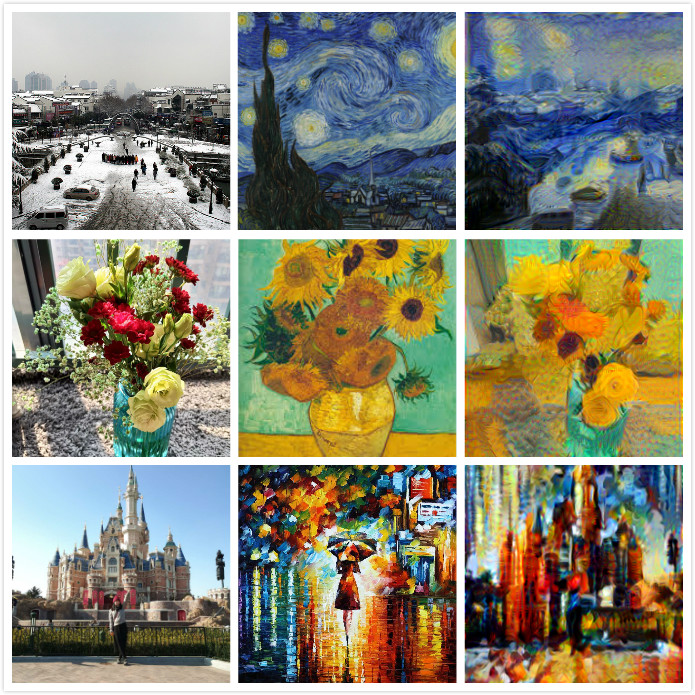

## Intro
This is a pycaffe implementation of the paper [A Neural Algorithm of Artistic Style](https://arxiv.org/abs/1508.06576), the paper provides a way of combine two images to one. While holding the original image's content, we can transfer the style from another image to this one. The image to transfer style from is called style_image, the image to be transfered is called content image.  
Below is som results  
  
## How to
You have to have the caffe installed with pycaffe, and make sure the PYTHONPATH is correctly set. Currently I used the vgg16 model, so the pre-trained vgg16 model is also needed, which can be found in the caffe zoo. When everything is done. usage  
``python main.py -c /pathto/content_img -s /pathto/style_img``  
You can see the code in main.py for more detail. 
