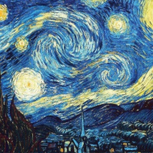

#  Style Transfer whole in one    
This repo contains two copies of code, both do the style transfer job. Using the code you can transfer styles from any image to another.      

**The optimized method**, based on [A Neural Algorithm of Artistic Style](https://arxiv.org/abs/1508.06576). It is an optimized way of doing style transfer and it may take several minutes to complete the transfer job. But no pre-trained model is needed, so you can transfer style from any image as you like without the training procedure. If you want to transfer a style without training and can bear the time to deploy, try this method. Refer to the document for more detail.      

**Fast Style Transfer**, based on [Perceptual Losses for Real-Time Style Transfer and Super-Resolution](https://arxiv.org/abs/1603.08155)[Instance Normalization: The Missing Ingredient for Fast Stylization](https://arxiv.org/abs/1607.08022). It can do the transfer job in a second, and you can even do the transfer job to videos! pre-trained style model is needed. If you care the deploy time and want to do real time style-transfer, try this method. Refer to the document for more detail.    

#  Image Stylization   
Here we show the results of both two methods. Note here that the image to transfer style from is called style-image and the image to be transfered is called content image. The transfered result can be adjust by the weight and layers to use.       

**The optimized way**      

 

 

 

 

**The Fast Style Transfer way**       

 

 

 

   

# Video Stylization      
Here only the Fast Style Transfer be deployed to the video style transfer, optimized way consumes too much time which is not feasible.     

     

#  Documentation   
All two works are done with python2.7, make sure you have it installed.   

## The optimized method    
### Requirements   
[caffe](http://caffe.berkeleyvision.org/) compiled with pycaffe, and make sure the PYTHONPATH is correctly set.     
[pre-trained vgg16 model](http://www.robots.ox.ac.uk/~vgg/software/very_deep/caffe/VGG_ILSVRC_16_layers.caffemodel)     
[scipy&numpy](https://www.scipy.org/)     
[pillow](https://pillow.readthedocs.io/en/4.1.x/)   

### Stylizing images      
Use the ``style.py`` to do the optimized job. Usage:   

``python style.py -c /pathto/content_img -s /pathto/style_img``     

Result is saved in current dir. You can see the code in optimize for more detail. Note since it has to optimize, several minutes can be taken to complete the whole, and time to consume is related to the image size and your device.    

## Fast Style Transfer    
When doing this fast style transfer, I find caffe's way to add new layer can be really complicated and it is not friendly to python interface. So I change the platform to tensorflow.     

### Requirements   
[tensorflow](https://www.tensorflow.org/)    
[scipy&numpy](https://www.scipy.org/)    
[pillow](https://pillow.readthedocs.io/en/4.1.x/)     
[opencv2.4](https://opencv-python-tutroals.readthedocs.io/en/latest/) --- needed if you want to style the video.    

### Train Style Models   
If you want to train your own style models, addition requirements are needed.   
[COCO dataset](http://msvocds.blob.core.windows.net/coco2014/train2014.zip), release it in a content folder  
[pre-trained vgg16 model](), note this model has been converted to be loaded with numpy interface  
[pyyaml](http://pyyaml.org/), needed to parse the config file    

Now change to the src/fast folder, change the contents in conf.yml with guidance in it and everything is done.   

``python train.py -c conf.yml``    

### Stylizing images   
Since it can do the style transfer job in a second, we can style many images all in once. Call the ``fast_style.py`` script as follows:   

``python fast_style.py -m <path to the pre-trained model dir> -i <image or folders contain image to transfer> -o <output dir>``     

For more possible params, run ``python fast_style.py`` to view.  

### Styling Videos   
Use the ``fast_style_video.py`` to transfer style for videos. Note opencv is needed when using this script. Usage:  

``python fast_style_video.py -m <path to pre-trained model dir> -i <path to input videos> -o <output dir>``  

For more detail, refer to the code in it.

### Trained Models   
released soon.  

### License  
Free for noncommercial use, contact me if for commercial use and feel free to email me if you have any question. 
